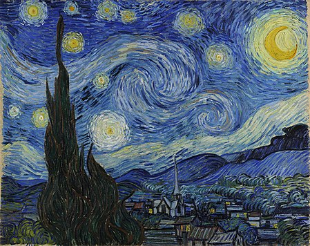
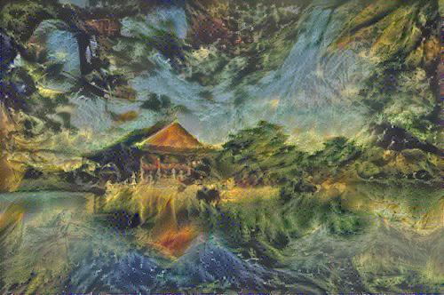

# Neural Style Transfer
This repository uses [VGG-16 pretrained model](http://arxiv.org/abs/1409.1556.pdf) to do Neural Style transfer. Download the checkpoint file [here](http://download.tensorflow.org/models/vgg_16_2016_08_28.tar.gz)

## Usage
```
train.py [-h] [--cnt cnt_img] [--stl stl_img] [--size size [size ...]]
                [--niters n_iters]

optional arguments:
  -h, --help            show this help message and exit
  --cnt cnt_img         Content Image for style transfer
  --stl stl_img         Style Image for style transfer
  --size size [size ...]
                        Size of output image [height, width]
  --niters n_iters      Number of iterations to run for
```

## Dependencies
1. Numpy
2. Scipy
3. Tensorflow


## Content Image


## Style Image


## Output Image
